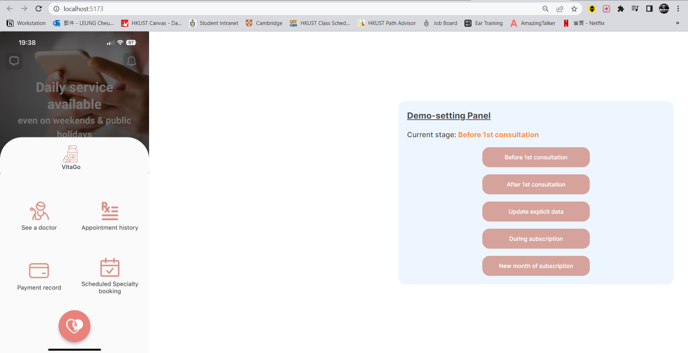
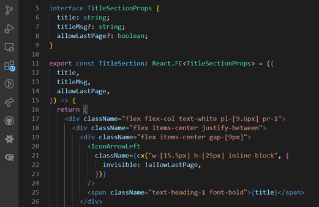

# TEMG4950K-VitaGo-prototype

## Table of Contents

### 1. [Getting Started](#intro)

### 2. [Prototype](#proto)

### 3. [File Structure](#files)

### 4. [About React](#react)

### 5. [About Typescript](#ts)

### 6. [About Tailwind CSS](#tailwind)

---

## Getting Started <a name="intro"></a>

### Welcome to the repository for the frontend of VitaGo.

> If you are here for **playing with the prototype**:

- You can clone the repository, <code>cd frontend</code> and type <code>yarn dev</code> or <code>npm dev</code> in the terminal. This should open the index page on a website. Note that the prototype is designed under the screen size of **393 x 852** so it is advised to adjust your screen accordingly

> If you are here for **development**:

- You should first install the following VSCode extensions for syncing with GitHub:

  1. Git Graph
  2. GitHub Pull Requests and Issues

- Install package manager **yarn** with <code>npm install --global yarn</code> (if you prefer, you can ignore this step and continue with npm)

- <code>cd frontend</code> and type **yarn** in terminal to install the required packages

---

## Prototype <a name="proto"></a>

When the website opens up, you should see this page:
<br/>

<br/>
You can toggle different stages of subscription with the panel on the right. Upon changing the stage, the display on the left will respond accordingly. In most of the cases, you can interact with the app by first clicking the VitaGo icon. The rest should be (and needs to be) quite straightforward for the user.

Have fun.

---

## File Structure <a name="files"></a>

Since we don't have a backend for the prototype, everything is in the frontend folder. The primary ones are explained below:

```
\---frontend
    |   .gitignore (specify what files should not be committed to GitHub)
    |   custom.d.ts (A file to declare a type that enables me to import .svg files as React components)
    |   index.html
    |   package.json (a list of packages used in the project)
    |   postcss.config.cjs
    |   tailwind.config.js (for configuring tailwindcss and aliases)
    |   tsconfig.json
    |   tsconfig.node.json
    |   vite.config.ts  (config for Vite, a tool to build web apps quickly. Much faster than create-react-app)
    |   yarn.lock (record of packages, no need to touch it manually)
    |
    └─src
        │  App.css
        │  App.tsx
        │  index.css
        │  main.tsx (typical entry point of the app)
        │  Routes.tsx (for page routing because React by itself is meant for single-page apps)
        │  vite-env.d.ts
        │
        ├─assets (for storing the icons (.svg) / images (.png) you used)
        ├─components (React components, see part (4) for more)
        ├─layouts
        └─pages
```

---

## About React <a name="react"></a>

What do you think of frontend development - thousands of <div> tags which you don’t know which part of the app they represent? Not very readable, right? Wouldn’t it be great if you can organize this page


into something like this:

```tsx
export default function Dashboard(){
  return (
    <TitleSection />
    <ContentSection>
      <PersonalProfile />
      <HealthStatistics />
    </ContentSection>
    <DoctorButton />
  )
}
```

Well that is exactly one of the motivation of using the JS library React! Component composition is about breaking down complex UI into simpler building blocks which you can reuse later. In fact, what you have at the end of this assignment should be something like the above as well. To show some values in a component, you will need to pass properties (called props) to it.



The above is a typical React component, comprising 2 essential parts:

1. An interface specifying what props the component should accept. In the example, TitleSection accepts an object with title and 2 optional props called titleMsg and allowLastPage (denoted by the “?” before the colon)
2. A function that returns a React functional component. The structure of the function can further be broken down into:

|                     Part                     |                                             Meaning                                              |
| :------------------------------------------: | :----------------------------------------------------------------------------------------------: |
| `TitleSection: React.FC<TitleSectionProps>`  | TitleSection is a React functional component (FC) that accepts TitleSectionProps as the argument |
| `({ title, titleMsg, allowLastPage }) => {}` |        Arrow function where the argument of TitleSectionProps is destructured into props         |
|     `() => { return (<div>...</div>) }`      |           The function will return HTML elements. This is also called a JSX expression           |

---

## About Typescript <a name="ts"></a>

To summarize the difference between Typescript and JavaScript, the former is strongly typed, requiring you to specify the type for variables or props. Though you may find it troublesome at first, this is actually for your own goods – trust me, type checking can help debugging A LOT. This time, we are not using Typescript too much because we are omitting many logics in the prototype.

Well, if you still hate it after trying it, you can always switch back to JavaScript since Typescript is the superset of JavaScript.

## About Tailwind CSS <a name="tailwind"></a>

From what I looked on Google, Tailwind CSS is a utility-first CSS framework that helps you do customizations and write less. But personally, I love using it because it’s intuitive and you can write CSS without creating a separate file with a bunch of class names. As for what property you should know, I would say knowing the box model (margin and padding) and flex box is enough to get you through many designs.

If you are not familiar with the abbreviation of a property, you can always look it up on the [[official site]](https://tailwindcss.com/). Eventually, you will get used to it.
